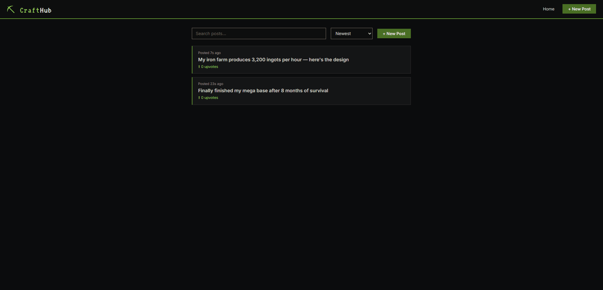

# WEB102 Final Project - CraftHub

Submitted by: **Nicholas Campos**

**CraftHub** is a community forum for Minecraft players to share builds, tips, questions, and ideas. Users can create posts, upvote their favorites, leave comments, and sort or search the feed.

Time spent: **4 hours** spent in total

## Required Features

The following **required** functionality is completed:

- [x] **Web app includes a create form that allows the user to create posts**
  - [x] Form requires users to add a post title
  - [x] Form has the option for users to add additional textual content
  - [x] Form has the option for users to add an image added as an external image URL
- [x] **Web app includes a home feed displaying previously created posts**
  - [x] Home feed displays previously created posts
  - [x] Each post on the feed shows only the post's creation time, title, and upvotes count by default
  - [x] Clicking on a post directs the user to a new page for the selected post
- [x] **Users can view posts in different ways**
  - [x] Users can sort posts by either creation time or upvotes count
  - [x] Users can search for posts by title
- [x] **Users can interact with each post in different ways**
  - [x] The app includes a separate post page for each created post, showing any additional information including content, image, and comments
  - [x] Users can leave comments underneath a post on the post page
  - [x] Each post includes an upvote button on the post page — each click increases the upvotes count by one
  - [x] Users can upvote any post any number of times
- [x] **A post that a user previously created can be edited or deleted from its post page**
  - [x] After a user creates a new post, they can go back and edit the post
  - [x] A previously created post can be deleted from its post page

## Optional Features

The following **optional** features are implemented:

- [ ] Web app implements pseudo-authentication
- [ ] Users can repost a previous post by referencing its post ID
- [ ] Users can customize the interface
- [ ] Users can add more characteristics to their posts (videos, flags, local image upload)
- [ ] Web app displays a loading animation whenever data is being fetched

## Video Walkthrough

Here's a walkthrough of implemented user stories:

> GIF created with [ScreenToGif](https://www.screentogif.com/)

## Notes

Describe any challenges encountered while building the app:

- Setting up Supabase and making sure Row Level Security was disabled so API requests would go through
- Wiring up React Router so each post gets its own URL (`/post/:id`)
- Handling the upvote update by reading the current count from state and incrementing it before sending the update to Supabase

## License

Copyright **2026** **Nicholas Campos**

Licensed under the Apache License, Version 2.0 (the "License");
you may not use this file except in compliance with the License.
You may obtain a copy of the License at

> http://www.apache.org/licenses/LICENSE-2.0

Unless required by applicable law or agreed to in writing, software
distributed under the License is distributed on an "AS IS" BASIS,
WITHOUT WARRANTIES OR CONDITIONS OF ANY KIND, either express or implied.
See the License for the specific language governing permissions and
limitations under the License.
